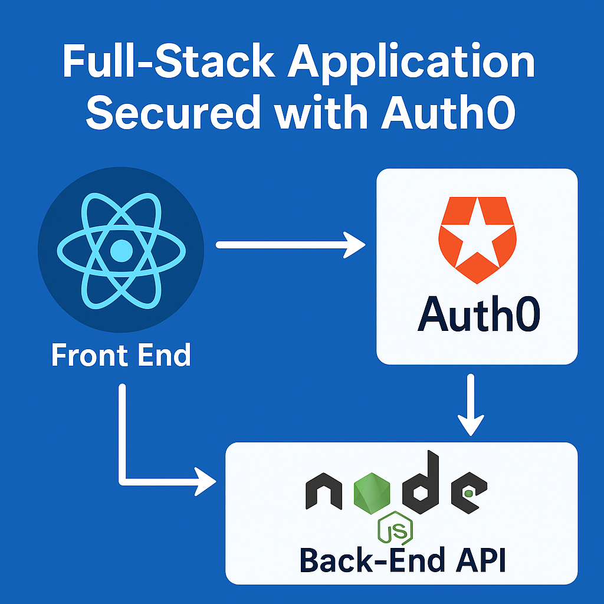

# 🔐 Full Stack Auth0-Protected React Application

This project is a secure, full-stack web application built with **React (frontend)** and **Node.js/Express (backend)**, showcasing the use of **Auth0 JWT access tokens** to protect API endpoints.

> ✅ Inspired by the Udemy course “[Secure Your Vue.js Applications with Auth0](https://www.udemy.com/course/secure-your-vuejs-applications-with-auth0/)” — but fully implemented in **React + TypeScript**.

---

## ✨ Features

- ✅ React + TypeScript front-end with routing
- ✅ Auth0 authentication (login/logout with redirect)
- ✅ Secure access to profile and messages views
- ✅ Protected Express backend (via Auth0 JWT verification)
- ✅ POST & GET messages with bearer token validation
- ✅ UI separation: `MessageForm`, `MessagesList`, and `MessagesPage`
- ✅ Elegant layout using Flexbox and custom CSS
- ✅ Auth0 logo integration + descriptive UI

---

## 📸 Preview



Or watch this short walkthrough:

🎥 [Demo Video](./demo.mp4)

---

## 🛠️ Tech Stack

| Layer     | Stack                           |
|-----------|---------------------------------|
| Frontend  | React + TypeScript + Auth0 SDK  |
| Backend   | Node.js + Express + express-jwt |
| Auth      | Auth0 (Universal Login)         |

---

## 🚀 How to Run Locally

```bash
# Clone the repo
git clone https://github.com/yourusername/auth0-react-ts-app.git
cd auth0-react-ts-app

# Frontend
cd front-end
npm install
npm start   # runs at http://localhost:3000

# In another terminal...
cd ../back-end
npm install
node src/server.js  # runs at http://localhost:3011
